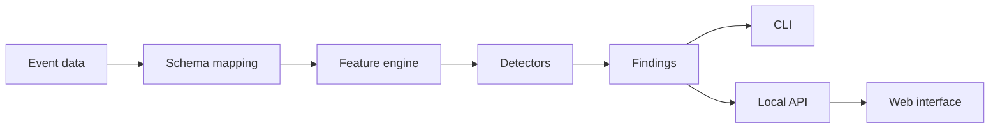

# Project Roadmap

**Working name:** Sift  
**Core language:** C++23  
**Documentation structure:** IEEE 1016  
**Documentation style:** ASD-STE100  
**Initial use case:** Application audit-event analysis

## 1. Product goal

Sift analyzes event data.

The tool builds a behavior history for each entity. It identifies unusual behavior and produces structured evidence.

The tool does not decide that an entity is malicious. It identifies results that need inspection.

Example:

```text
Entity: user-142
Score: 0.87

Evidence:
- Export count in the last 24 hours: 81
- Historical median: 4
- The user accessed 12 new resources
- The event sequence was rare in the reference dataset
```

## 2. Product shape



The core engine must work without the web interface.

## 3. Initial scope

The first release will support:

- CSV, JSON Lines, and Parquet input
- A canonical event format
- User-defined schema mapping
- Entity timelines
- Time-window features
- Personal behavior baselines
- Simple cohort baselines
- Statistical detectors
- One machine-learning detector
- Structured evidence
- Historical replay
- A CLI
- A local investigation interface

The first release will not support:

- Real-time distributed processing
- Multi-user organizations
- Enterprise authentication
- Case management
- Cloud hosting
- Deep learning
- Graph neural networks
- LLM-generated explanations
- Arbitrary Python code in the runtime
- A stable third-party binary plug-in ABI

---

# Milestone 0 — Project definition

## Goal

Define the product before implementation starts.

## Work

Create:

- Product requirements document
- Initial Software Design Description
- Project glossary
- System-context diagram
- Initial data model
- Architecture Decision Records
- Reference dataset specification

Define the canonical concepts:

- Event
- Entity
- Relationship
- Feature
- Signal
- Finding
- Analysis run

## Initial decisions

Create these ADRs:

- ADR-001: Use C++23 for the core product.
- ADR-002: Use local and batch processing first.
- ADR-003: Use a canonical event model.
- ADR-004: Keep detection logic outside the frontend.
- ADR-005: Require structured evidence from each detector.
- ADR-006: Treat anomaly scores as rankings, not probabilities.
- ADR-007: Use chronological replay for evaluation.
- ADR-008: Do not use an LLM in the core product.

## Exit criteria

- The input and output formats are defined.
- The initial use case is defined.
- The non-goals are documented.
- Each core component has one clear responsibility.

---

# Milestone 1 — First vertical slice

## Goal

Prove the complete product concept with one detector.

## Work

Implement:

1. Read one Parquet file.
2. Validate the required columns.
3. Convert each row to a canonical event.
4. Group events by entity.
5. Calculate event counts in 24-hour windows.
6. Calculate a robust deviation from historical behavior.
7. Rank entities by score.
8. Print structured evidence through the CLI.

Example command:

```bash
sift analyze events.parquet --config sift.yaml
```

Example configuration:

```yaml
timestamp: occurred_at
event_type: action
entity_id: user_id
```

## Detector

Use a transparent statistical detector.

Recommended first method:

- Historical median
- Median absolute deviation
- Robust deviation score

Do not add Isolation Forest in this milestone.

## Exit criteria

- The command processes a complete dataset.
- The result is reproducible.
- The detector does not use future events.
- Unit tests verify all feature values manually.
- The output explains each score.

This milestone is the first usable version of the tool.

---

# Milestone 2 — Canonical ingestion

## Goal

Accept different datasets without changing the engine.

## Work

Add:

- CSV input
- JSON Lines input
- Parquet input
- Typed field validation
- Optional event attributes
- Optional numeric values
- Clear import errors
- Schema-mapping validation

Canonical event:

```text
Event
- event ID
- event type
- timestamp
- primary entity ID
- target entity ID
- attributes
- numeric values
```

## Exit criteria

- All input formats produce the same canonical events.
- Invalid rows include a clear row number and reason.
- Input order does not change event identity.
- The importer handles large files without loading all raw data into memory.

---

# Milestone 3 — Feature engine

## Goal

Create reusable behavioral features.

## Work

Implement:

- Fixed time windows
- Rolling time windows
- Event counts
- Numeric sums and medians
- Unique target counts
- New categorical-value detection
- Time-since-last-event features
- Hour-of-day distributions
- Personal baseline comparisons
- Basic cohort comparisons

Example features:

```text
login_count_24h
export_bytes_24h
unique_resources_7d
new_device_ratio_30d
activity_hour_rarity
export_count_vs_personal_baseline
export_count_vs_cohort_baseline
```

Feature definitions must be independent from detector definitions.

## Exit criteria

- Batch calculation and chronological replay give equivalent results.
- Feature calculations do not use future data.
- Each feature has unit tests.
- Feature names and types are stable inside one analysis run.

---

# Milestone 4 — Detector framework

## Goal

Support multiple detection methods through one internal interface.

## Work

Implement built-in detectors for:

- Robust numeric deviation
- Categorical rarity
- Sudden behavior change
- Rare event transitions
- Rare event n-grams
- Isolation Forest

Each detector must return:

- Detector identifier
- Detector version
- Entity or event reference
- Raw score
- Normalized score
- Structured evidence

Python can support model research and training. Python must not be required to run the main application.

Use a model format or native adapter for production inference.

## Exit criteria

- Each detector can run independently.
- Each detector produces structured evidence.
- Detector errors do not corrupt the complete analysis run.
- The same model and input produce the same result.
- The system records the detector version.

---

# Milestone 5 — Replay and evaluation

## Goal

Measure whether detector changes improve the tool.

## Work

Implement:

- Chronological event replay
- Scenario labels
- Synthetic suspicious scenarios
- Detector comparison
- Alert-count reporting
- Precision and recall when labels exist
- Detection-delay measurement
- Top-k result evaluation
- Model regression reports

Example:

```bash
sift evaluate \
  --events events.parquet \
  --labels labels.json \
  --candidate detector-v2.yaml
```

Example report:

```text
Detector v1 -> v2

Scenario recall:         72% -> 84%
Alerts per 1,000 users:  19 -> 12
Median detection delay:  38 min -> 21 min

Regression:
- False positives increased for new users.
```

## Exit criteria

- Detector versions can be compared.
- The report identifies missed scenarios.
- The report identifies new false positives.
- Tests detect time-based data leakage.
- Score changes can be traced to detector or feature changes.

This milestone is essential. Do not postpone it until after the frontend.

---

# Milestone 6 — Persistence and local API

## Goal

Store analysis runs and expose them to other clients.

## Work

Add:

- Local result database
- Analysis-run records
- Entity records
- Feature records
- Signal records
- Finding records
- Pagination
- Filtering
- Local HTTP API
- OpenAPI description

Suggested storage:

- DuckDB for analytical data
- SQLite or DuckDB for local metadata

The project should use one database initially when practical.

## Exit criteria

- The CLI and API call the same application services.
- The API contains no duplicate scoring logic.
- A user can inspect old analysis runs.
- A user can trace a finding to its source events and signals.

---

# Milestone 7 — Investigation interface

## Goal

Make findings easy to inspect.

## Required views

### Analysis runs

Show:

- Dataset
- Configuration
- Detector versions
- Run date
- Result count

### Finding list

Show:

- Entity
- Score
- Strongest signals
- Time range
- Filters

### Entity view

Show:

- Event timeline
- Personal baseline
- Cohort comparison
- Related entities
- Signal evidence

### Evaluation view

Show:

- Detector comparison
- Alert-volume changes
- Missed scenarios
- New false positives

## Rules

- The frontend must not calculate scores.
- The frontend must not create evidence.
- The frontend must not contain detector logic.
- The API response is the source of truth.

## Exit criteria

- A user can inspect the reference dataset without reading raw JSON.
- Every displayed result links to structured evidence.
- The interface starts through one local command.
- The complete tool remains usable through the CLI.

---

# Milestone 8 — First public release

## Goal

Make the project usable by another developer.

## Work

Add:

- Installation package
- Example dataset
- Example configuration
- Demonstration scenarios
- User guide
- Developer guide
- Contribution guide
- Performance benchmarks
- Memory benchmarks
- Security policy
- Release process

Example workflow:

```bash
sift demo
sift serve
```

## Exit criteria

- A new user can run the demonstration from the README.
- The default installation requires no cloud service.
- The default installation requires no Kubernetes cluster.
- The tool sends no data to an external service.
- Example results are reproducible.
- The project documentation follows the approved terminology.

---

## 4. Suggested repository structure

```text
sift/
├── src/
│   ├── domain/
│   ├── ingestion/
│   ├── features/
│   ├── detectors/
│   ├── evaluation/
│   ├── storage/
│   ├── api/
│   └── cli/
├── include/
├── frontend/
├── research/
├── tests/
│   ├── unit/
│   ├── integration/
│   ├── replay/
│   └── fixtures/
├── examples/
├── schemas/
├── docs/
│   ├── requirements/
│   ├── design/
│   ├── adr/
│   ├── diagrams/
│   ├── testing/
│   └── glossary.md
└── CMakeLists.txt
```

The `research` directory can contain optional Python scripts. The production runtime must not depend on them.

## 5. Stop conditions

Stop and review the project when one of these conditions occurs:

- The frontend becomes larger than the engine.
- A feature requires distributed infrastructure for the first release.
- A detector cannot explain its score.
- Evaluation depends only on visual inspection.
- The project requires domain claims that cannot be tested.
- A new feature does not improve the reference use case.
- The tool becomes a generic data platform.

## 6. Recommended implementation order

Use this order:

1. Project documents
2. One Parquet vertical slice
3. Canonical ingestion
4. Feature engine
5. Transparent detectors
6. Replay and evaluation
7. Isolation Forest integration
8. Persistence
9. Local API
10. Web interface
11. Public release

Do not build the frontend before the replay and evaluation system works.
